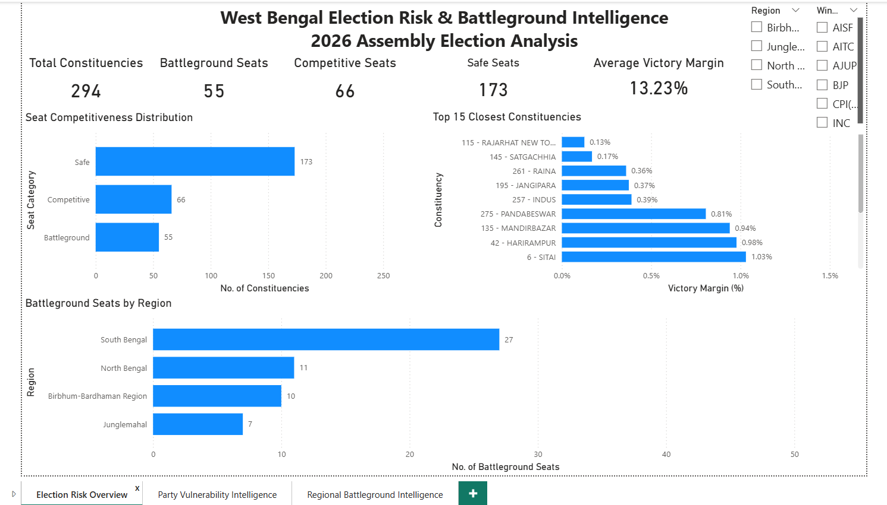
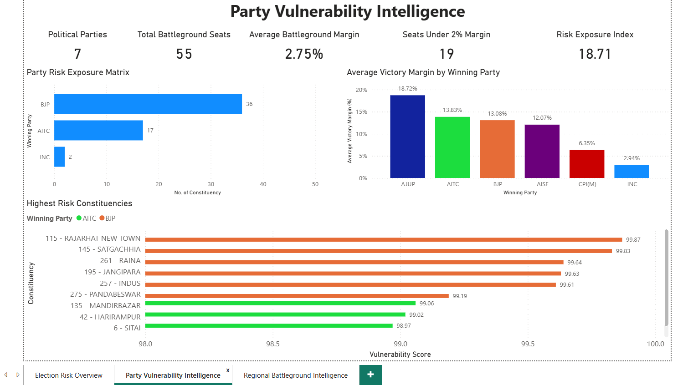
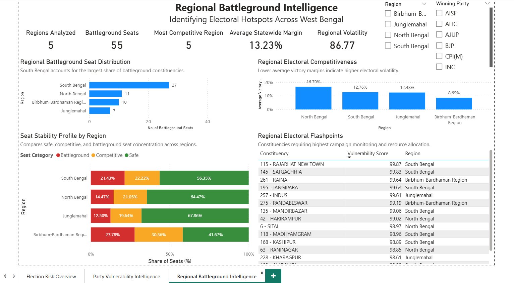

# West Bengal Election Risk Intelligence

## Project Overview

This project analyzes electoral competitiveness across 294 West Bengal Assembly constituencies using Power BI.

The dashboard identifies:

- Battleground constituencies
- Competitive seats
- Safe seats
- Party-level risk exposure
- Regional electoral hotspots
- High vulnerability constituencies

---

## Tools Used

- Microsoft Excel
- Power BI Desktop
- Data Modeling
- DAX Measures
- Political Risk Scoring Framework

---

## Dashboard Pages

### 1. Election Risk Overview

Provides statewide distribution of safe, competitive and battleground seats.

---

### 2. Party Vulnerability Intelligence

Analyzes party-level exposure to vulnerable constituencies.

---

### 3. Regional Battleground Intelligence

Highlights electoral hotspots and regional competitiveness.

---

## Key Metrics

- Political Vulnerability Score
- Victory Margin %
- Battleground Seat Count
- Risk Exposure Index
- Regional Volatility

---

## Author

Saharsh Hemant Deshmukh
